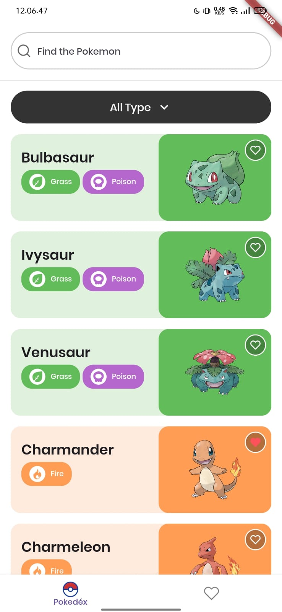
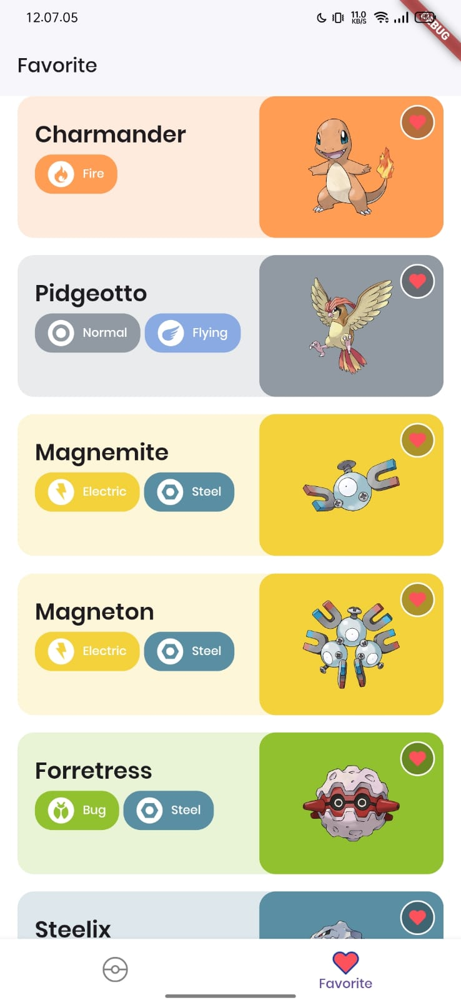
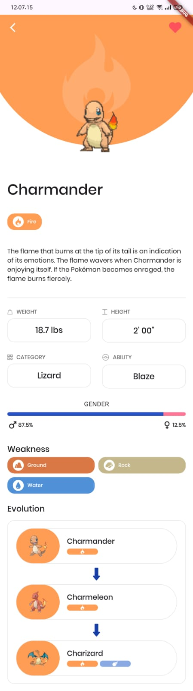

# Pokedex App

A Flutter-based Pokedex app that lets users browse, search, and filter Pokémon data with smooth pagination and favorite management.

## Features

- Browse a comprehensive list of Pokémon with pagination.
- Search Pokémon by name or Pokédex number (supports input with or without `#`).
- Filter Pokémon by type.
- Mark Pokémon as favorites and manage favorite list.
- Responsive UI with loading shimmer effects.
- Smooth scroll with lazy loading and prefetching.
- Clean architecture using Provider for state management.

## Screenshots

- Home and Favorite Page

  
  

- Detail Page

  

